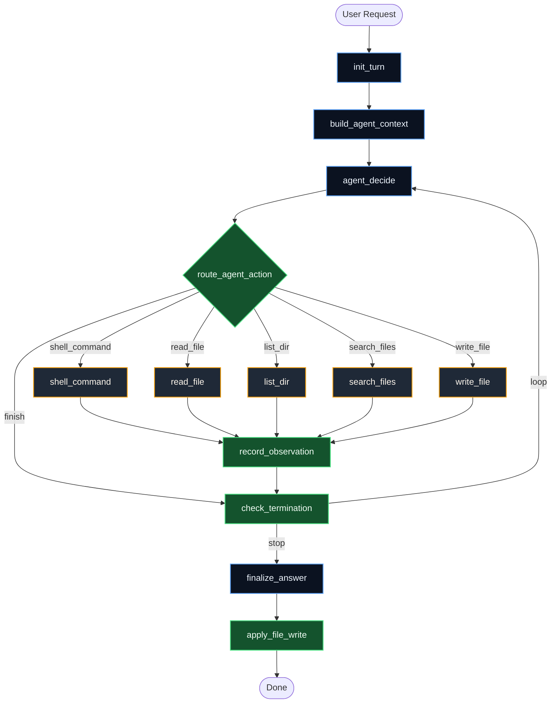
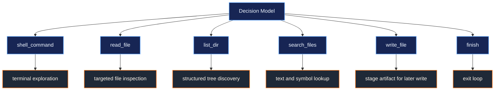
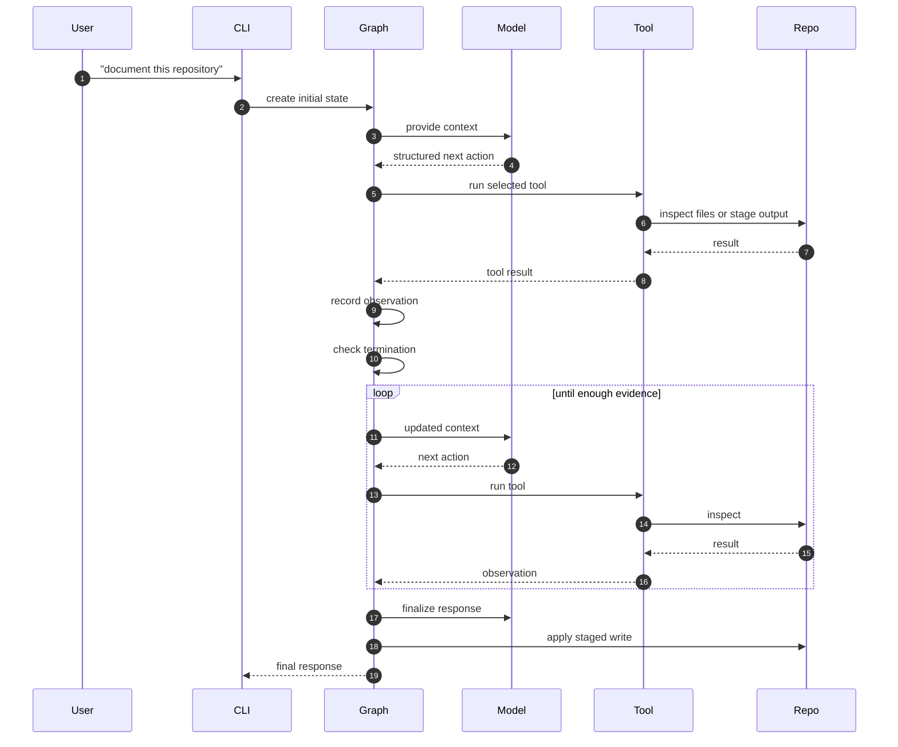

# Tinkler

<p align="center">
  <strong>A repo agent that thinks in loops, not scripts.</strong>
</p>

<p align="center">
  Tinkler uses LangGraph to inspect a codebase, choose one action at a time, collect evidence, and only write once it has enough signal.
</p>

<p align="center">
  
  
  
</p>

---

## The Pitch

Most repo agents still behave like this:

```text
inspect -> summarize -> write
```

That looks neat, but it breaks as soon as the repo stops being neat.

Tinkler is built around a tighter loop:

```text
context -> decide -> tool -> observe -> loop -> finalize
```

It does not assume where the truth lives. It finds it.

---

## Why It Feels Different

| Traditional Repo Agent | Tinkler |
| --- | --- |
| follows a fixed inspection order | adapts every turn |
| plans too much up front | chooses one action at a time |
| writes early | stages writes and applies them at the end |
| treats tool output as terminal | turns tool output into new context |
| fragile on odd repo layouts | works better on uneven, real-world codebases |

---

## Architecture At A Glance



---

## The Core Loop


This is the whole design: every action earns the next action.

---

## Agent Surface



Types and routing live in [`agent/state.py`](agent/state.py), [`agent/actions/schemas.py`](agent/actions/schemas.py), and [`agent/graph.py`](agent/graph.py).

---

## Repo Layout

```text
Tinkler/
├── agent/
│   ├── __main__.py
│   ├── graph.py
│   ├── state.py
│   ├── actions/
│   │   ├── parser.py
│   │   └── schemas.py
│   ├── nodes/
│   │   ├── agent_decide.py
│   │   ├── build_agent_context.py
│   │   ├── check_termination.py
│   │   ├── finalize_answer.py
│   │   ├── init_turn.py
│   │   ├── record_observation.py
│   │   └── route_agent_action.py
│   ├── prompts/
│   └── tools/
├── pyproject.toml
└── README.md
```

---

## What Happens In One Run



---

## Quick Start

### 1. Install

```bash
python -m venv .venv
source .venv/bin/activate
pip install -e .
```

### 2. Configure

```bash
export OPENAI_API_KEY=your_key_here
export OPENAI_MODEL=gpt-4o-mini
```

### 3. Run

```bash
python -m agent "write a repo summary" --cwd .
```

With an explicit turn limit:

```bash
python -m agent "document this codebase" --cwd . --max-turns 12
```

Entrypoint: [`agent/__main__.py`](agent/__main__.py)

---

## Design Choices

### One Action Per Turn

The model is forced to stay grounded. It does not invent a long multi-step script and hope it still makes sense three tool calls later.

### Deferred Writes

`write_file` prepares content first. The actual write is applied later by [`agent/nodes/apply_file_write.py`](agent/nodes/apply_file_write.py), after the answer is finalized. That keeps mutation controlled.

### Structured Decisions

The model emits typed decisions, parsed through [`agent/actions/parser.py`](agent/actions/parser.py) and [`agent/actions/schemas.py`](agent/actions/schemas.py), before the graph routes execution.

---

## Stack

- Python 3.11+
- LangGraph
- LangChain OpenAI
- setuptools

Dependency source: [`pyproject.toml`](pyproject.toml)

---

## Key Files

- [`agent/graph.py`](agent/graph.py): graph assembly and routing
- [`agent/nodes/agent_decide.py`](agent/nodes/agent_decide.py): structured action selection
- [`agent/state.py`](agent/state.py): typed runtime state
- [`agent/tools/write_file.py`](agent/tools/write_file.py): deferred write staging
- [`agent/__main__.py`](agent/__main__.py): CLI entrypoint

---

## Summary

Tinkler is a small repo agent with a strong constraint: it must learn from each step before taking the next one. That single choice makes the rest of the architecture make sense.
