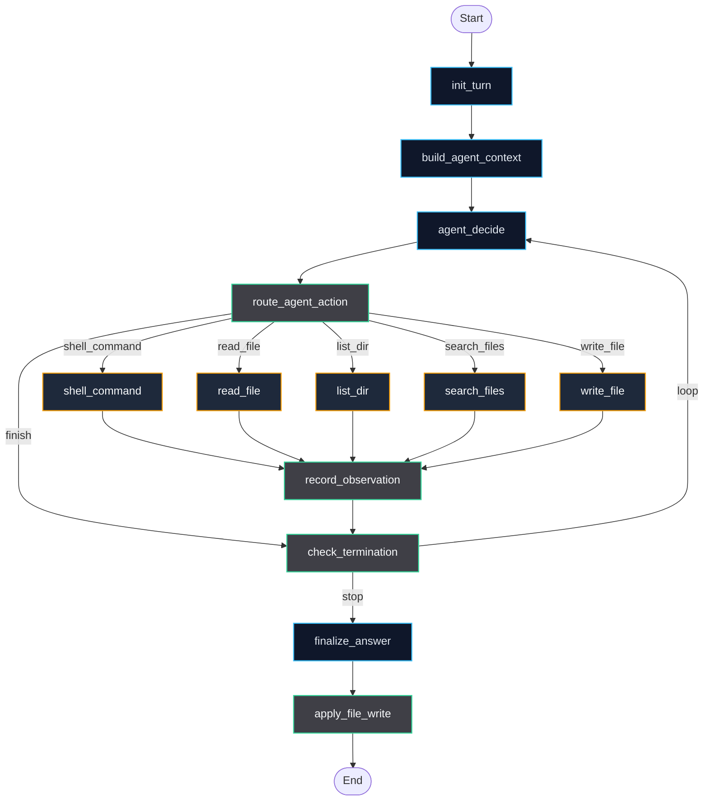
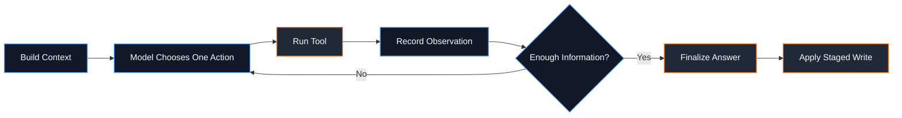
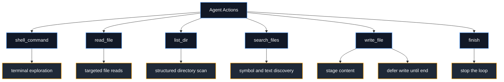
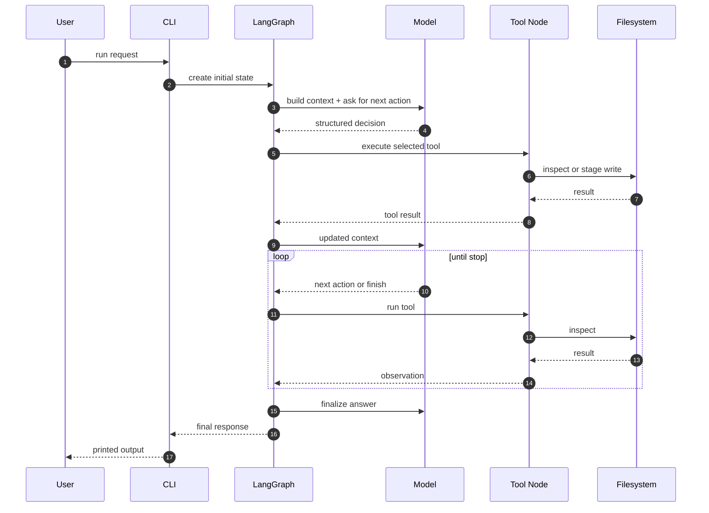

# Tinkler

Minimal LangGraph repo agent for inspecting a codebase, deciding one action at a time, collecting observations, and writing a final artifact only after the loop is complete.

## Why This Repo Exists

Most repo agents are too rigid:

- inspect in a fixed order
- summarize too early
- write before they have enough evidence

Tinkler is built around a tighter control loop:

`think -> act -> observe -> decide again`

That makes it better suited to uneven repositories where the important clue might be in `pyproject.toml`, a test file, a shell script, or a nested package.

## Visual Overview



## Control Loop



## Architecture

### State

The agent keeps a typed state object with:

- request and repo root
- turn counters and stop conditions
- working summary
- tool history
- observations
- discovered files and directories
- likely entrypoints
- repo facts
- pending write path and content
- final response

Core definition: [`agent/state.py`](agent/state.py)

### Graph

The graph is compiled in [`agent/graph.py`](agent/graph.py) and wires the execution order like this:

1. Initialize turn state.
2. Build prompt context from everything learned so far.
3. Ask the model for exactly one next action.
4. Route that action to the correct tool node.
5. Record the result as an observation.
6. Decide whether to loop or stop.
7. Generate the final answer.
8. Apply the staged file write.

### Available Actions



Tool implementations live under [`agent/tools`](agent/tools).

## Project Layout

```text
Tinkler/
├── agent/
│   ├── __main__.py           # CLI entrypoint
│   ├── graph.py              # LangGraph assembly
│   ├── state.py              # Typed agent state
│   ├── actions/              # decision schema + parser
│   ├── nodes/                # graph nodes
│   ├── prompts/              # system and context prompts
│   └── tools/                # filesystem and shell tools
├── pyproject.toml
└── README.md
```

## Execution Flow



## Quick Start

### Install

```bash
python -m venv .venv
source .venv/bin/activate
pip install -e .
```

### Configure

```bash
export OPENAI_API_KEY=your_key_here
export OPENAI_MODEL=gpt-4o-mini
```

### Run

```bash
python -m agent "write a repo summary" --cwd .
```

Example with a turn limit:

```bash
python -m agent "document this codebase" --cwd . --max-turns 12
```

Entrypoint: [`agent/__main__.py`](agent/__main__.py)

## Design Decisions

### One Action Per Turn

The model does not plan a long script. It picks one action, sees the result, and adapts. That keeps the loop grounded in repo reality instead of speculative planning.

### Deferred Writes

`write_file` stages output first. The actual write happens later in `apply_file_write`, after the final response is ready. This reduces premature mutations and keeps the run easier to reason about.

Related nodes:

- [`agent/tools/write_file.py`](agent/tools/write_file.py)
- [`agent/nodes/apply_file_write.py`](agent/nodes/apply_file_write.py)

### Structured Decisions

The model output is parsed into a typed action schema before routing. That keeps tool execution narrow and explicit.

Related files:

- [`agent/actions/schemas.py`](agent/actions/schemas.py)
- [`agent/actions/parser.py`](agent/actions/parser.py)
- [`agent/nodes/agent_decide.py`](agent/nodes/agent_decide.py)

## Current Stack

- Python 3.11+
- LangGraph
- LangChain OpenAI
- setuptools build backend

Source of truth: [`pyproject.toml`](pyproject.toml)

## What Makes It Different

```text
Fixed pipeline agents:
  inspect -> summarize -> write

Tinkler:
  context -> decide -> tool -> observe -> loop -> finalize
```

That difference is the whole architecture.
